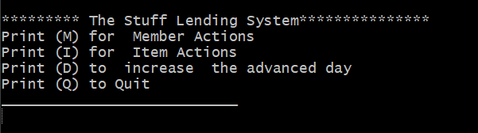

# A2

Project for Assignment 2

A project template based on gradle and a gitlab pipeline. You should always build and run the application using gradle regularely.

[design.md](design.md) contains the prescribed architectural design of the application.

## Building
The build must pass by running console command:  
`./gradlew build`  

## Running
The application should start by running console command:  
`./gradlew run -q --console=plain`

## System test
[testreport.md](testreport.md) The program test report.

## Usage of the application

The program starts with a console user interface thats has four options:
- the first one helps the user to add, update, delete and list members and gives two list options one is a simple list and verbose list which list member information with all owned items including who they are currently lent to and the time period.
- With the second option can the user create , delete, update, view an item info including the contracts for an item. And can create a contract to the available items.
- The third option gives the possibility to advance the days forward.
- The forth gives the user the option to quit the application. 

## Developers
- Manar Alibrahim ma226hn
- Shirin Meirkhan sm223qi